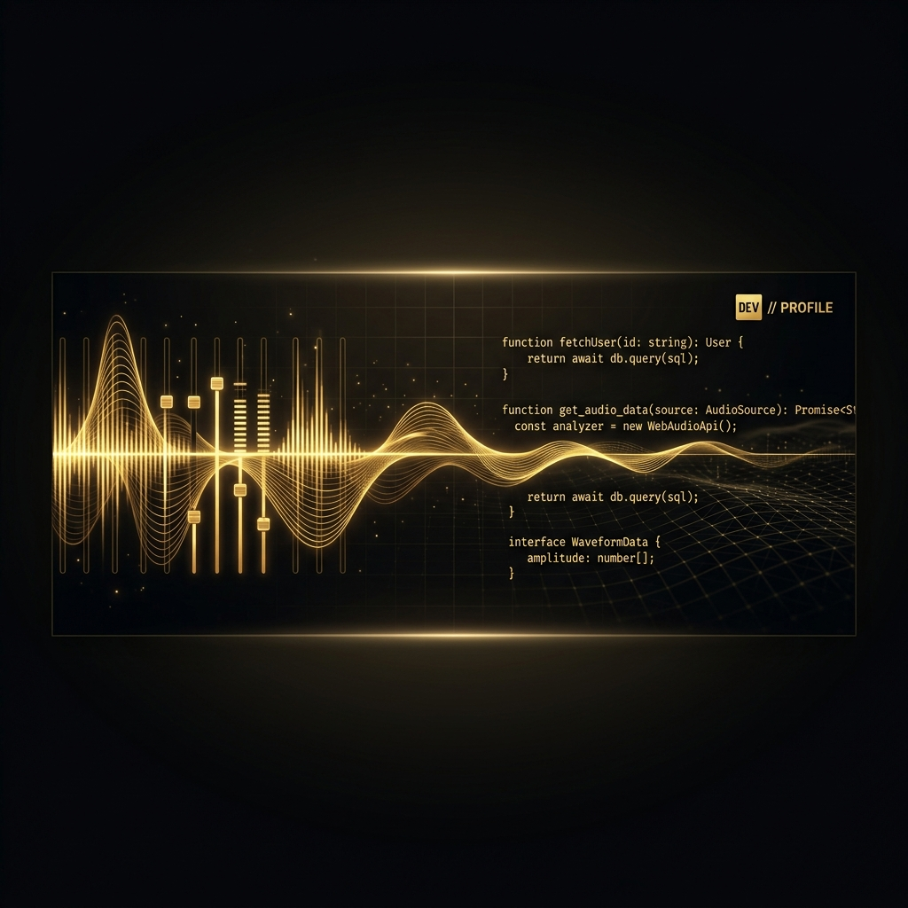

  <!-- Banner Personalizado Code & Beats -->
  

  <!-- Typing SVG de Bienvenida -->
  

  <h3>
    <strong>Full Stack Backend Developer | DJ & Music Producer</strong>
  </h3>

  

    <em>Desarrollador full stack especializado en Node.js, JavaScript y TypeScript, apasionado por crear arquitecturas escalables y de alto rendimiento. Con experiencia en la implementación de soluciones óptimas y seguras utilizando NestJS, y en la gestión de bases de datos tanto relacionales como no relacionales, siempre dispuesto a enfrentar cualquier desafío.</em>
  

### 💫 Un poco sobre mí / About Me

- 📚 **Aprendiendo activamente / Currently learning:** Nuevas tecnologías de infraestructura, optimización de rendimiento y arquitecturas avanzadas para Backend.
- 🤝 **Colaboraciones / Open to collaborate:** Proyectos backend desafiantes con Node.js, NestJS, TypeScript y arquitecturas de alto rendimiento.
- 💬 **Hablemos de / Ask me about:** Ingeniería de software, diseño de bases de datos, patrones de arquitectura y buenas prácticas.
- 📫 **Contacto directo / Reach me at:** **yosoykann@gmail.com** o a través de [**LinkedIn**](https://www.linkedin.com/in/kristian-ferrin-583976270/).
- ⚡ **Dato curioso / Fun fact:** Además de la programación, me apasiona la música. Soy DJ y Productor Musical. La fusión entre el código y el ritmo musical potencia mi creatividad, mi enfoque en los detalles y mi velocidad de adaptación ante nuevos retos.

### 🎧 Coding to the Beat / Mi Lado Musical

> *"La música y el desarrollo de software comparten un lenguaje común: el ritmo de las líneas de código y el compás de las frecuencias de sonido."*

Como DJ y Productor Musical, entiendo el valor de la estructura, la sincronización y la armonía. En el desarrollo backend aplico la misma filosofía: **atención minuciosa al detalle, flujos de trabajo optimizados y la integración perfecta de múltiples servicios para crear un sistema robusto y envolvente.**

  <!-- Marcadores para enlaces musicales del usuario -->
  
  
  
  

  <!-- Typing SVG para Habilidades -->
  

 

| Categoria | Tecnologías |
| :--- | :--- |
| **Backend & Frameworks** |      |
| **Lenguajes** |    |
| **Bases de Datos & ORMs** |     |
| **DevOps & Servicios** |      |
| **Diseño & Estilo** |     |
| **Herramientas de Desarrollo** |      |
| **Hosting & Deploy** |   |

  <!-- Tarjetas de Estadísticas en Negro y Dorado -->
  <h3>📊 Actividad & Estadísticas / GitHub Stats</h3>
   
  
  <table border="0">
    <tr>
      <td valign="top" width="50%">
        
      </td>
      <td valign="top" width="50%">
        
      </td>
    </tr>
  </table>
  
   
  
  

<!-- Redes Sociales y Contacto -->

  <h3>Let's Connect & Collab / Conectemos 🤝</h3>
   
  
  
  
  <!-- Marcador para perfiles musicales / DJ del usuario -->
  
  

 

  

